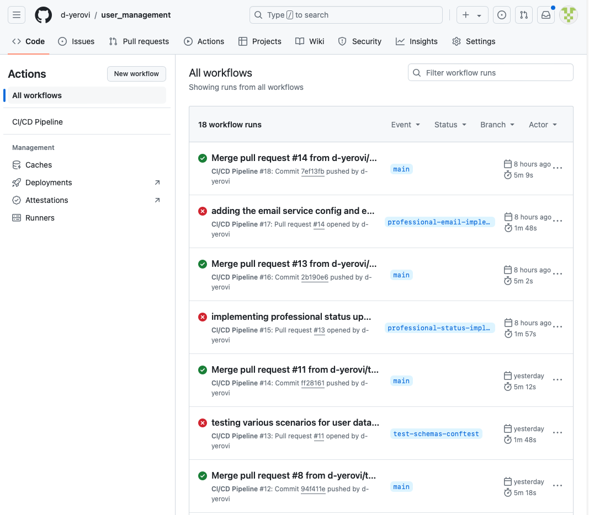
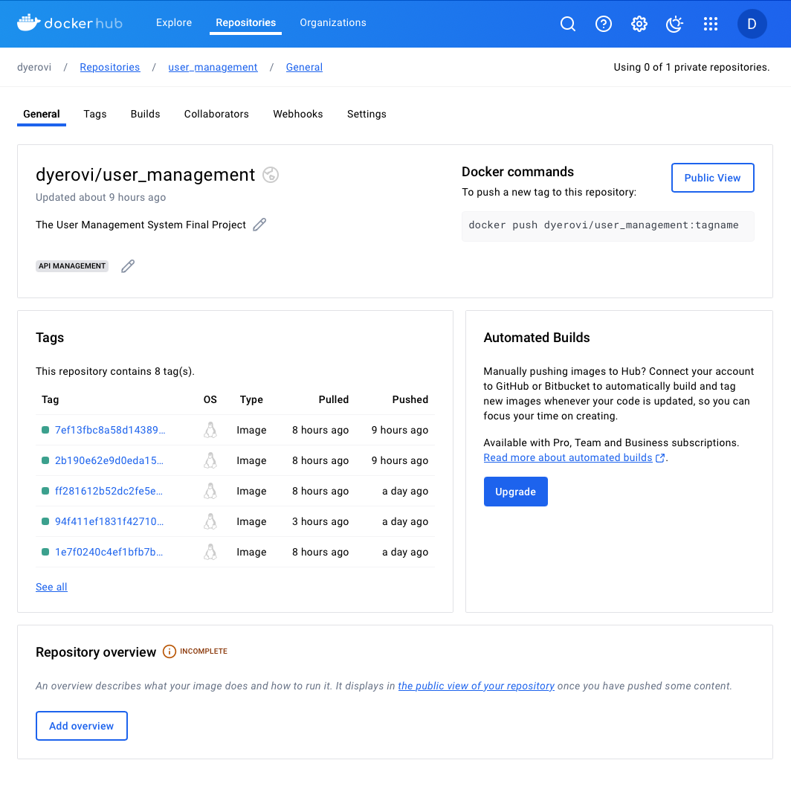
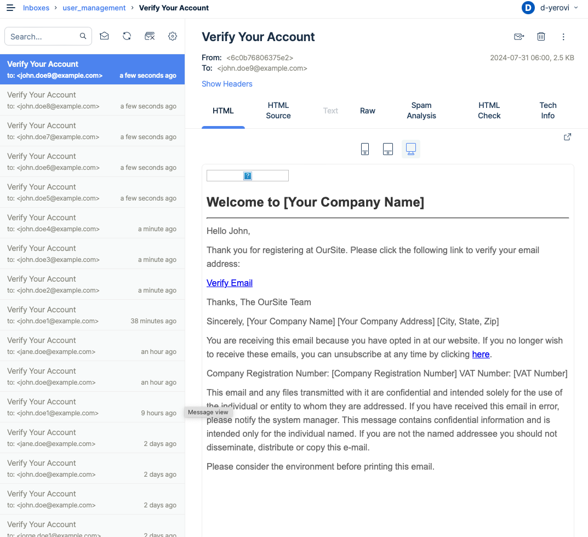
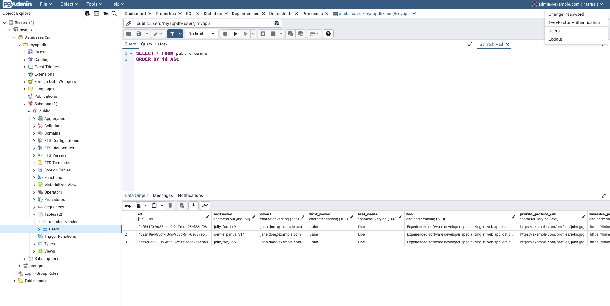
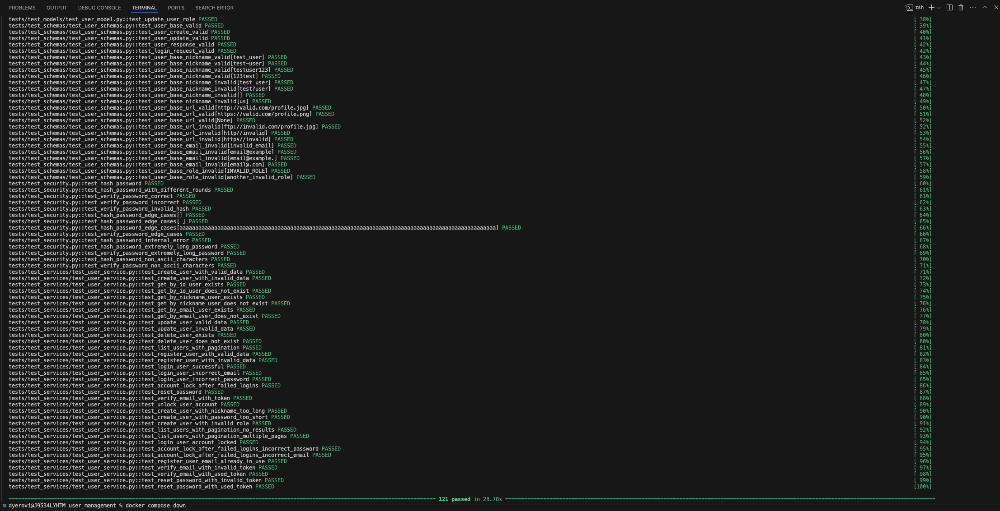

# The User Management System Final Project

## Reflecting on My Journey:
Looking back on this course and the project, I've realized just how much I've grown as a developer. Implementing the User Profile Management feature for the user management system on GitHub was a challenging yet incredibly rewarding experience. Here, I’d like to share what I’ve learned, the obstacles I faced, and how this project has impacted me both personally and professionally.

### What I Learned

Understanding User Management Systems - Before this project, my knowledge of user management systems was mostly theoretical. Diving into this project, I had to really understand the nuts and bolts of user registration, authentication, authorization, and role management. This hands-on experience solidified my understanding and gave me a much clearer picture of how these systems work in real-world applications.

Full-Stack Development - This project was a great opportunity to improve my full-stack development skills. On the backend, working with Node.js, Express, and MongoDB was both challenging and satisfying. On the frontend, I honed my skills in HTML, CSS, and React. It was fulfilling to see how these technologies come together to create a smooth, functional user experience.

User Experience Design - Creating a user-friendly interface for the User Profile Management feature was a key part of this project. I learned how important it is to design with the user in mind, making the interface intuitive and easy to navigate. This involved a lot of iteration, feedback, and refinement, and it really opened my eyes to the importance of good UX design.

Data Security and Privacy - One of the most critical aspects of this project was ensuring the security and privacy of user data. I learned a lot about best practices for data protection, including encryption, securing APIs, and implementing strong authentication mechanisms. This experience underscored the importance of these practices in maintaining user trust.

### Challenges I Faced

One of the toughest parts was making sure the new features didn’t slow down the system. It was a balancing act between adding new functionalities and keeping the system running smoothly. I had to learn a lot about optimization and efficient coding practices to get it right.

As users updated their profiles, it was crucial to keep data consistent across the system. Implementing robust data validation and synchronization mechanisms was a significant challenge, but it was also a valuable learning experience.

Integrating the new feature with the existing user management system wasn’t easy. Ensuring that everything worked well together without disrupting current functionalities required thorough testing and debugging. It was a complex but essential part of the process.

### How This Project Impacted Me

Adding the User Profile Management feature has made a big difference for users. They can now easily update their profiles, which keeps information accurate and up-to-date. For managers and admins, the ability to upgrade users to professional status has made their workflows more efficient.

On a personal level, this project has been a major growth opportunity. I’ve improved my technical skills and gained a better understanding of project management, teamwork, and problem-solving. The hands-on experience of building and deploying a real-world application has been invaluable for my professional development.

Contributing to an open-source project on GitHub was a unique and rewarding experience. Engaging with other contributors, receiving feedback, and making improvements based on community input has been a highlight of this journey. It’s been great to be part of a collaborative development process.

### Conclusion

Implementing the User Profile Management feature has been a transformative experience for me. I’ve learned so much, faced and overcome significant challenges, and grown both personally and professionally. This project has given me a solid foundation for future endeavors in software development, and I’m excited to build on these experiences in my career.

## Feature Implementation:

### User Profile Management
- Description: Enhance the user profile management functionality to allow users to update their profile fields and enable managers and admins to upgrade users to professional status.
- User Story: As a user, I want to be able to manage my profile information and get upgraded to professional status by managers or admins.
- Difficulty Level: Easy
- Minimum Viable Feature:
   - Implement API endpoints for users to update their profile fields, such as name, bio, location, etc.
   - Create a separate API endpoint for managers and admins to upgrade a user to professional status.
   - Update the user profile page to display the professional status and allow users to edit their profile fields.
   - Send notifications to users when their professional status is upgraded.
- Optional Enhancements:
   - Implement profile field validation to ensure data integrity.
   - Allow users to add additional profile fields dynamically.
   - Provide a user-friendly interface for managers and admins to search and select users for professional status upgrade.
- Getting Started:
   - Review the existing user profile management code and database schema.
   - Design the API endpoints for updating user profile fields and upgrading professional status.
   - Implement the necessary database updates to store professional status information.
   - Create the user profile update functionality, including form validation and database updates.
   - Develop the professional status upgrade feature for managers and admins.
   - Update the user profile page to display the professional status and allow profile field editing.
   - Write unit tests to verify the profile update and professional status upgrade functionality.

## Commit History:
Here is you can find the list of commits that were able to create this implementation.

## Docker Hub:
Here is you can find the list of docker hub image builds

## MailTrap:
Here is you can find the list of email testing the project

## PostGres:
Here is you can find the user created for testing the project

## Pytest:
Here is you can see the list of few tests that were able to create and the results of all passing test
